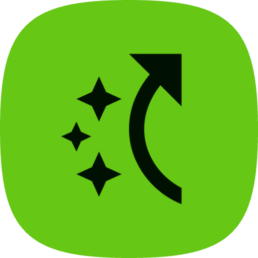

<div align="center">
    
</div>


# Hotz : Hotkeys Specifier for Webpages.

A Chrome extension that allows you to assign Hotkeys  to any element on a webpage. Click on any button, link, or interactive element and assign it a key - then just press that key to trigger the element!

## Features

- 🎯 **Easy Element Selection**: Click on any element to select it
- ⌨️ **Custom Key Binding**: Assign any key to trigger the selected element
- 💾 **Persistent Storage**: Key bindings are saved per tab and persist during your browsing session
- 👁️ **Visual Feedback**: See which key was pressed and get visual confirmation
- 📋 **Binding Management**: View and manage all your key bindings
- 🗑️ **Easy Cleanup**: Remove individual bindings or clear all at once

## How to Use

### Installation

1. **Download or Clone** this repository to your local machine
2. **Open Chrome** and navigate to `chrome://extensions/`  
3. **Enable Developer Mode** by clicking the toggle in the top right corner
4. **Click "Load unpacked"** and select the folder containing the extension files
5. The extension should now appear in your extensions list and toolbar

### Using the Extension

1. **Click the Extension Icon** in your Chrome toolbar to open the popup
2. **Click "Start Element Selection"** to enter selection mode
3. **Hover over elements** on the webpage - they will be highlighted in green
4. **Click on the element** you want to assign a key to
5. **Press any key** in the dialog that appears (e.g., 'R', 'Space', 'Enter', etc.)
6. **Click "Assign Key"** to confirm the binding

### Triggering Elements

Once you've assigned a key to an element:
- Simply **press the assigned key** while on that webpage
- The element will be triggered as if you clicked it
- You'll see a visual feedback showing which key was pressed

### Managing Bindings

- **View Bindings**: Click "View Key Bindings" in the popup to see all active bindings
- **Remove Binding**: Click the "×" button next to any binding to remove it
- **Clear All**: Click "Clear All Bindings" to remove all key bindings for the current page

## Technical Details

### Files Structure

```
Element-Key-Binder/
├── manifest.json          # Extension configuration
├── popup.html             # Extension popup interface
├── popup.js              # Popup functionality
├── content.js            # Main content script
├── content.css           # Styling for content script
├── background.js         # Background service worker
├── icons/                # Extension icons
│   └── icon.svg         # SVG icon
└── README.md            # This file
```

### How It Works

1. **Content Script**: Injected into every webpage to handle element selection and key listening
2. **Element Selection**: Uses mouse events to highlight and select elements
3. **Key Binding Storage**: Uses Chrome's local storage API to save bindings per tab
4. **Unique Selectors**: Generates CSS selectors to uniquely identify elements
5. **Event Handling**: Intercepts keyboard events and triggers bound elements

### Key Features Implementation

- **Element Highlighting**: CSS outline and background color changes
- **Unique Identification**: Generates CSS selectors using IDs, classes, and DOM paths
- **Storage Management**: Tab-specific storage that auto-cleans when tabs are closed
- **Conflict Prevention**: Prevents binding the same key to multiple elements
- **Input Field Exclusion**: Doesn't interfere with typing in input fields

## Supported Keys

The extension supports most keyboard keys including:
- Letters (A-Z)
- Numbers (0-9)
- Special keys (Space, Enter, Tab, etc.)
- Function keys (F1-F12)
- Arrow keys

**Note**: Modifier keys (Shift, Ctrl, Alt) alone cannot be bound, but combinations work.

## Limitations

- Key bindings are **tab-specific** and don't persist across browser sessions
- Elements that are dynamically loaded after binding may not work if their selectors change
- Some websites may prevent certain key events from being intercepted
- Bindings are cleared when the tab is closed or refreshed

## Troubleshooting

### Element Not Responding to Key Press
- The element may have been removed or changed since binding
- Try rebinding the key to the element
- Check if the element is still visible and clickable

### Can't Select Certain Elements
- Some elements may be covered by other elements
- Try clicking directly on the text or icon within the element
- Ensure the element is actually clickable

### Extension Not Working
- Refresh the webpage and try again
- Check that the extension is enabled in `chrome://extensions/`
- Look for any errors in the browser console (F12)

## Privacy & Security

- **No Data Collection**: This extension does not collect or send any personal data
- **Local Storage Only**: All bindings are stored locally on your device
- **No External Requests**: The extension doesn't make any network requests
- **Minimal Permissions**: Only requests necessary permissions for functionality

## Browser Compatibility

| Browser | Compatibility |
|---------|---------------|
| Chrome | Fully supported (Manifest V3) |
| Edge | Should work (Chromium-based) |
| Firefox | Would need adaptation for Manifest V2 |
| Safari | Not supported |

## Contributing

Feel free to contribute to this project by:
- Reporting bugs or issues
- Suggesting new features
- Submitting pull requests
- Improving documentation


---

**Enjoy using Hotz: Hotkey Specifier for Webpages** 🎯⌨️
